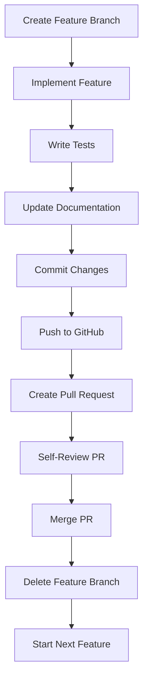

# 🎃 Hacktoberfest 2024-2025: Study Group App Contribution Guide

## 🎯 Overview

This guide will help you structure your Study Group application development into **6-8 meaningful pull requests**** for Hacktoberfest 2024-2025. Each PR will add substantial value to your project while following best practices for open-source contributions.

## 📋 Prerequisites

- Git installed and configured
- GitHub account
- Node.js 18+ and npm/yarn
- MongoDB and Redis (for local development)
- Basic knowledge of React, Node.js, and Git

---

## 🚀 Phase 1: Initial Setup (One-Time)

### 1. Initialize Git Repository

```bash
# Navigate to your project directory
cd "F:\Project2\study group project"

# Initialize git repository
git init

# Create .gitignore file
cat > .gitignore << 'EOF'
# Dependencies
node_modules/
npm-debug.log*
yarn-debug.log*
yarn-error.log*

# Environment variables
.env
.env.local
.env.development.local
.env.test.local
.env.production.local

# Build outputs
dist/
build/
.next/
out/

# Database
*.db
*.sqlite

# Logs
logs/
*.log

# Runtime data
pids/
*.pid
*.seed
*.pid.lock

# Coverage directory used by tools like istanbul
coverage/
.nyc_output/

# IDE
.vscode/
.idea/
*.swp
*.swo

# OS
.DS_Store
Thumbs.db

# Uploads
uploads/
temp/
EOF

# Add initial files
git add .
git commit -m "feat: initial project setup with design documents

- Add high-level design document
- Add user management module design
- Add group management module design
- Add scheduling module design
- Add real-time communication module design
- Add PDF collaboration module design
- Add AI assistant module design
- Add API specifications
- Add database schemas
- Add implementation guide"
```

### 2. Create GitHub Repository

```bash
# Create repository on GitHub (via web interface or GitHub CLI)
gh repo create study-group-app --public --description "A collaborative study group application with real-time features"

# Add remote origin
git remote add origin https://github.com/YOUR_USERNAME/study-group-app.git

# Push to GitHub
git push -u origin main
```

### 3. Enable Hacktoberfest Topic

1. Go to your repository on GitHub
2. Click on the gear icon (⚙️) next to "About"
3. Add the topic: `hacktoberfest`
4. Add additional topics: `study-group`, `collaboration`, `real-time`, `education`

### 4. Set Up GitHub Actions CI

Create `.github/workflows/ci.yml`:

```yaml
name: CI

on:
  push:
    branches: [ main, develop ]
  pull_request:
    branches: [ main, develop ]

jobs:
  test:
    runs-on: ubuntu-latest
    
    services:
      mongodb:
        image: mongo:6.0
        ports:
          - 27017:27017
      redis:
        image: redis:6.0-alpine
        ports:
          - 6379:6379

    steps:
    - uses: actions/checkout@v4
    
    - name: Setup Node.js
      uses: actions/setup-node@v4
      with:
        node-version: '18'
        cache: 'npm'
    
    - name: Install dependencies
      run: |
        cd backend
        npm ci
    
    - name: Run tests
      run: |
        cd backend
        npm test
      env:
        MONGODB_URI: mongodb://localhost:27017/studygroup_test
        REDIS_URL: redis://localhost:6379
        JWT_SECRET: test-secret
```

### 5. Create CONTRIBUTING.md

```markdown
# Contributing to Study Group App

## Getting Started

1. Fork the repository
2. Clone your fork: `git clone https://github.com/YOUR_USERNAME/study-group-app.git`
3. Create a feature branch: `git checkout -b feature/your-feature-name`
4. Make your changes
5. Run tests: `npm test`
6. Commit your changes: `git commit -m "feat: add your feature"`
7. Push to your fork: `git push origin feature/your-feature-name`
8. Create a Pull Request

## Development Setup

### Backend
```bash
cd backend
npm install
npm run dev
```

### Frontend
```bash
cd frontend
npm install
npm start
```

## Code Style

- Use TypeScript for type safety
- Follow ESLint configuration
- Write tests for new features
- Use conventional commits

## Pull Request Guidelines

- Use descriptive titles
- Include tests for new features
- Update documentation as needed
- Ensure all tests pass
```

---

## 🎯 Phase 2: Feature Breakdown into 6-8 PRs

### PR #1: Project Foundation & Authentication System
**Branch:** `feature/project-foundation-auth`
**Estimated Time:** 2-3 days
**Value:** High - Core functionality

#### Commits:
```bash
git checkout -b feature/project-foundation-auth

# Commit 1: Project structure setup
git add backend/package.json backend/tsconfig.json backend/src/app.ts
git commit -m "feat: initialize backend project structure

- Add Express.js server setup
- Configure TypeScript
- Add basic middleware (CORS, helmet, morgan)
- Set up environment configuration"

# Commit 2: Database models
git add backend/src/models/User.ts backend/src/models/StudyGroup.ts
git commit -m "feat: add core database models

- Implement User model with authentication fields
- Implement StudyGroup model with member management
- Add password hashing and validation
- Include proper TypeScript interfaces"

# Commit 3: Authentication service
git add backend/src/services/userService.ts backend/src/controllers/authController.ts
git commit -m "feat: implement authentication service

- Add user registration and login
- Implement JWT token generation and validation
- Add password hashing with bcrypt
- Include refresh token mechanism"

# Commit 4: Authentication routes
git add backend/src/routes/auth.ts backend/src/middleware/auth.ts
git commit -m "feat: add authentication API endpoints

- POST /api/auth/register
- POST /api/auth/login
- POST /api/auth/refresh
- POST /api/auth/logout
- Add JWT middleware for protected routes"

# Commit 5: Tests
git add backend/tests/auth.test.ts
git commit -m "test: add authentication tests

- Unit tests for user service
- Integration tests for auth endpoints
- Test JWT token validation
- Test password hashing"

# Commit 6: Documentation
git add backend/README.md
git commit -m "docs: add authentication module documentation

- API endpoint documentation
- Authentication flow explanation
- Setup instructions for developers"
```

#### Code Snippets to Implement:

**backend/src/models/User.ts:**
```typescript
import mongoose, { Schema, Document } from 'mongoose';
import bcrypt from 'bcryptjs';

export interface IUser extends Document {
  email: string;
  username: string;
  passwordHash: string;
  profile: {
    firstName: string;
    lastName: string;
    avatar?: string;
    timezone: string;
  };
  preferences: {
    notifications: boolean;
    theme: 'light' | 'dark';
    language: string;
  };
  createdAt: Date;
  lastLogin?: Date;
  isActive: boolean;
  comparePassword(candidatePassword: string): Promise<boolean>;
}

const userSchema = new Schema<IUser>({
  email: {
    type: String,
    required: true,
    unique: true,
    lowercase: true,
    trim: true
  },
  username: {
    type: String,
    required: true,
    unique: true,
    trim: true
  },
  passwordHash: {
    type: String,
    required: true
  },
  profile: {
    firstName: { type: String, required: true },
    lastName: { type: String, required: true },
    avatar: String,
    timezone: { type: String, default: 'UTC' }
  },
  preferences: {
    notifications: { type: Boolean, default: true },
    theme: { type: String, enum: ['light', 'dark'], default: 'light' },
    language: { type: String, default: 'en' }
  },
  createdAt: { type: Date, default: Date.now },
  lastLogin: Date,
  isActive: { type: Boolean, default: true }
});

// Hash password before saving
userSchema.pre('save', async function(next) {
  if (!this.isModified('passwordHash')) return next();
  
  try {
    const salt = await bcrypt.genSalt(12);
    this.passwordHash = await bcrypt.hash(this.passwordHash, salt);
    next();
  } catch (error) {
    next(error as Error);
  }
});

// Compare password method
userSchema.methods.comparePassword = async function(candidatePassword: string): Promise<boolean> {
  return bcrypt.compare(candidatePassword, this.passwordHash);
};

export default mongoose.model<IUser>('User', userSchema);
```

**Push and Create PR:**
```bash
git push origin feature/project-foundation-auth

# Create PR with title: "feat: Add project foundation and authentication system"
# Description: "This PR establishes the project foundation and implements a complete authentication system with user registration, login, JWT tokens, and password security."
```

---

### PR #2: Group Management System
**Branch:** `feature/group-management`
**Estimated Time:** 2-3 days
**Value:** High - Core collaboration feature

#### Commits:
```bash
git checkout -b feature/group-management

# Commit 1: Group model and service
git add backend/src/models/StudyGroup.ts backend/src/services/groupService.ts
git commit -m "feat: implement group management service

- Add StudyGroup model with member roles
- Implement group creation and joining
- Add invite code generation
- Include permission system"

# Commit 2: Group controller and routes
git add backend/src/controllers/groupController.ts backend/src/routes/groups.ts
git commit -m "feat: add group management API endpoints

- POST /api/groups (create group)
- GET /api/groups (get user groups)
- POST /api/groups/:id/join (join group)
- PUT /api/groups/:id (update group settings)
- DELETE /api/groups/:id (delete group)"

# Commit 3: Member management
git add backend/src/services/memberService.ts
git commit -m "feat: add member management functionality

- Add/remove group members
- Update member roles (owner, admin, member)
- Generate and validate invite codes
- Handle member permissions"

# Commit 4: Tests
git add backend/tests/group.test.ts
git commit -m "test: add group management tests

- Test group creation and joining
- Test member role management
- Test invite code functionality
- Test permission system"

# Commit 5: Documentation
git add docs/group-management.md
git commit -m "docs: add group management documentation

- API endpoint documentation
- Permission system explanation
- Group lifecycle management"
```

#### Code Snippets to Implement:

**backend/src/services/groupService.ts:**
```typescript
import StudyGroup from '../models/StudyGroup';
import User from '../models/User';

export class GroupService {
  async createGroup(ownerId: string, groupData: CreateGroupDto): Promise<StudyGroup> {
    const group = new StudyGroup({
      ...groupData,
      ownerId,
      members: [{
        userId: ownerId,
        role: 'owner',
        joinedAt: new Date(),
        permissions: ['manage_group', 'manage_members', 'manage_meetings', 'manage_files']
      }],
      inviteCode: this.generateInviteCode()
    });
    
    return await group.save();
  }

  async joinGroup(userId: string, groupId: string, inviteCode?: string): Promise<StudyGroup> {
    const group = await StudyGroup.findById(groupId);
    if (!group) throw new Error('Group not found');
    
    if (group.settings.isPrivate && group.inviteCode !== inviteCode) {
      throw new Error('Invalid invite code');
    }
    
    if (group.members.length >= group.settings.maxMembers) {
      throw new Error('Group is full');
    }
    
    group.members.push({
      userId,
      role: 'member',
      joinedAt: new Date(),
      permissions: ['view_group', 'join_meetings', 'upload_files']
    });
    
    return await group.save();
  }

  private generateInviteCode(): string {
    const chars = 'ABCDEFGHIJKLMNOPQRSTUVWXYZ0123456789';
    let result = '';
    for (let i = 0; i < 8; i++) {
      result += chars.charAt(Math.floor(Math.random() * chars.length));
    }
    return result;
  }
}
```

---

### PR #3: Meeting Scheduling System
**Branch:** `feature/meeting-scheduling`
**Estimated Time:** 2-3 days
**Value:** High - Core scheduling feature

#### Commits:
```bash
git checkout -b feature/meeting-scheduling

# Commit 1: Meeting model and service
git add backend/src/models/Meeting.ts backend/src/services/meetingService.ts
git commit -m "feat: implement meeting scheduling service

- Add Meeting model with attendees and room management
- Implement meeting creation and updates
- Add meeting room ID generation
- Include meeting status management"

# Commit 2: Meeting controller and routes
git add backend/src/controllers/meetingController.ts backend/src/routes/meetings.ts
git commit -m "feat: add meeting scheduling API endpoints

- POST /api/meetings (create meeting)
- GET /api/meetings (get user meetings)
- PUT /api/meetings/:id (update meeting)
- DELETE /api/meetings/:id (cancel meeting)
- POST /api/meetings/:id/join (join meeting)"

# Commit 3: Calendar integration
git add backend/src/services/calendarService.ts
git commit -m "feat: add calendar integration features

- Generate iCalendar (.ics) files
- Export meeting to calendar
- Handle meeting conflicts
- Add timezone support"

# Commit 4: Notification system
git add backend/src/services/notificationService.ts
git commit -m "feat: add meeting notification system

- Send meeting reminders
- Email notifications for new meetings
- In-app notification handling
- Meeting status updates"

# Commit 5: Tests
git add backend/tests/meeting.test.ts
git commit -m "test: add meeting scheduling tests

- Test meeting creation and updates
- Test calendar integration
- Test notification system
- Test meeting room management"

# Commit 6: Documentation
git add docs/meeting-scheduling.md
git commit -m "docs: add meeting scheduling documentation

- API endpoint documentation
- Calendar integration guide
- Notification system explanation"
```

---

### PR #4: Real-time Chat System
**Branch:** `feature/real-time-chat`
**Estimated Time:** 2-3 days
**Value:** High - Real-time communication

#### Commits:
```bash
git checkout -b feature/real-time-chat

# Commit 1: Chat model and Socket.io setup
git add backend/src/models/ChatMessage.ts backend/src/socket/chatSocket.ts
git commit -m "feat: implement real-time chat system

- Add ChatMessage model for message storage
- Set up Socket.io for real-time communication
- Implement message broadcasting
- Add typing indicators"

# Commit 2: Chat service and controller
git add backend/src/services/chatService.ts backend/src/controllers/chatController.ts
git commit -m "feat: add chat management functionality

- Implement message sending and receiving
- Add message editing and deletion
- Include file attachment support
- Add message history retrieval"

# Commit 3: Chat routes and middleware
git add backend/src/routes/chat.ts backend/src/middleware/socketAuth.ts
git commit -m "feat: add chat API endpoints and socket authentication

- GET /api/chat/messages/:meetingId
- POST /api/chat/messages
- PUT /api/chat/messages/:id
- DELETE /api/chat/messages/:id
- Add socket authentication middleware"

# Commit 4: File upload handling
git add backend/src/utils/fileUpload.ts backend/src/middleware/upload.ts
git commit -m "feat: add file upload for chat messages

- Implement file upload with validation
- Add image and document support
- Include file size and type restrictions
- Add secure file storage"

# Commit 5: Tests
git add backend/tests/chat.test.ts
git commit -m "test: add chat system tests

- Test message sending and receiving
- Test file upload functionality
- Test real-time events
- Test socket authentication"

# Commit 6: Documentation
git add docs/real-time-chat.md
git commit -m "docs: add real-time chat documentation

- Socket.io event documentation
- File upload guidelines
- Chat API endpoints"
```

---

### PR #5: PDF Collaboration System
**Branch:** `feature/pdf-collaboration`
**Estimated Time:** 3-4 days
**Value:** High - Advanced collaboration feature

#### Commits:
```bash
git checkout -b feature/pdf-collaboration

# Commit 1: PDF models and upload service
git add backend/src/models/PDFDocument.ts backend/src/models/PDFAnnotation.ts
git commit -m "feat: implement PDF document management

- Add PDFDocument model with permissions
- Add PDFAnnotation model for collaborative annotations
- Implement PDF upload with GridFS
- Add PDF metadata extraction"

# Commit 2: PDF service and rendering
git add backend/src/services/pdfService.ts backend/src/utils/pdfRenderer.ts
git commit -m "feat: add PDF processing and rendering

- Implement PDF page rendering
- Add thumbnail generation
- Include PDF text extraction
- Add annotation management"

# Commit 3: PDF controller and routes
git add backend/src/controllers/pdfController.ts backend/src/routes/pdf.ts
git commit -m "feat: add PDF collaboration API endpoints

- POST /api/pdf/upload
- GET /api/pdf/:id/pages
- POST /api/pdf/:id/annotations
- PUT /api/pdf/annotations/:id
- DELETE /api/pdf/annotations/:id"

# Commit 4: Real-time collaboration
git add backend/src/socket/pdfSocket.ts backend/src/services/collaborationService.ts
git commit -m "feat: add real-time PDF collaboration

- Implement Yjs for collaborative editing
- Add real-time annotation synchronization
- Include user presence indicators
- Add conflict resolution"

# Commit 5: Tests
git add backend/tests/pdf.test.ts
git commit -m "test: add PDF collaboration tests

- Test PDF upload and processing
- Test annotation management
- Test real-time collaboration
- Test permission system"

# Commit 6: Documentation
git add docs/pdf-collaboration.md
git commit -m "docs: add PDF collaboration documentation

- PDF processing guide
- Annotation system explanation
- Real-time collaboration setup"
```

---

### PR #6: AI Assistant Integration
**Branch:** `feature/ai-assistant`
**Estimated Time:** 3-4 days
**Value:** High - Advanced AI features

#### Commits:
```bash
git checkout -b feature/ai-assistant

# Commit 1: AI models and OpenAI integration
git add backend/src/models/AIQuery.ts backend/src/models/PDFAnalysis.ts
git commit -m "feat: implement AI query and analysis models

- Add AIQuery model for chat interactions
- Add PDFAnalysis model for document analysis
- Implement OpenAI API integration
- Add query context management"

# Commit 2: AI service implementation
git add backend/src/services/aiService.ts backend/src/services/openaiService.ts
git commit -m "feat: add AI assistant functionality

- Implement text query processing
- Add voice query support with Whisper
- Include PDF analysis and summarization
- Add intelligent Q&A system"

# Commit 3: AI controller and routes
git add backend/src/controllers/aiController.ts backend/src/routes/ai.ts
git commit -m "feat: add AI assistant API endpoints

- POST /api/ai/query
- POST /api/ai/voice-query
- POST /api/ai/analyze-pdf
- POST /api/ai/summarize
- GET /api/ai/queries/:meetingId"

# Commit 4: Document processing and embeddings
git add backend/src/services/documentProcessor.ts backend/src/services/embeddingService.ts
git commit -m "feat: add document processing and vector search

- Implement document chunking and embedding
- Add vector similarity search
- Include context retrieval for AI queries
- Add document indexing"

# Commit 5: Tests
git add backend/tests/ai.test.ts
git commit -m "test: add AI assistant tests

- Test query processing
- Test PDF analysis
- Test voice processing
- Test document embedding"

# Commit 6: Documentation
git add docs/ai-assistant.md
git commit -m "docs: add AI assistant documentation

- OpenAI integration guide
- Query processing explanation
- Document analysis features"
```

---

### PR #7: Frontend Authentication & Dashboard
**Branch:** `feature/frontend-auth-dashboard`
**Estimated Time:** 2-3 days
**Value:** High - User interface foundation

#### Commits:
```bash
git checkout -b feature/frontend-auth-dashboard

# Commit 1: React app setup and routing
git add frontend/package.json frontend/src/App.tsx frontend/src/index.tsx
git commit -m "feat: initialize React frontend application

- Set up React with TypeScript
- Add React Router for navigation
- Configure Material-UI theme
- Add basic project structure"

# Commit 2: Authentication components
git add frontend/src/components/auth/Login.tsx frontend/src/components/auth/Register.tsx
git commit -m "feat: add authentication UI components

- Implement login form with validation
- Add registration form
- Include form error handling
- Add loading states"

# Commit 3: Authentication service and context
git add frontend/src/services/api.ts frontend/src/hooks/useAuth.ts
git commit -m "feat: add authentication service and context

- Implement API service with axios
- Add authentication context provider
- Include token management
- Add automatic token refresh"

# Commit 4: Dashboard and navigation
git add frontend/src/components/Dashboard.tsx frontend/src/components/Navigation.tsx
git commit -m "feat: add main dashboard and navigation

- Implement user dashboard
- Add responsive navigation
- Include user profile display
- Add logout functionality"

# Commit 5: Tests
git add frontend/src/tests/auth.test.tsx
git commit -m "test: add frontend authentication tests

- Test login and registration forms
- Test authentication context
- Test API service integration
- Test navigation components"

# Commit 6: Documentation
git add frontend/README.md
git commit -m "docs: add frontend documentation

- Setup instructions
- Component documentation
- Authentication flow explanation"
```

---

### PR #8: Frontend Group Management & Meetings
**Branch:** `feature/frontend-groups-meetings`
**Estimated Time:** 3-4 days
**Value:** High - Core functionality UI

#### Commits:
```bash
git checkout -b feature/frontend-groups-meetings

# Commit 1: Group management components
git add frontend/src/components/groups/GroupList.tsx frontend/src/components/groups/GroupCard.tsx
git commit -m "feat: add group management UI components

- Implement group list and cards
- Add group creation modal
- Include group settings
- Add member management"

# Commit 2: Meeting scheduling components
git add frontend/src/components/meetings/MeetingList.tsx frontend/src/components/meetings/MeetingForm.tsx
git commit -m "feat: add meeting scheduling UI

- Implement meeting list and calendar view
- Add meeting creation form
- Include meeting details modal
- Add meeting status indicators"

# Commit 3: Real-time chat interface
git add frontend/src/components/chat/ChatWindow.tsx frontend/src/components/chat/MessageList.tsx
git commit -m "feat: add real-time chat interface

- Implement chat window with message list
- Add message input with file upload
- Include typing indicators
- Add message timestamps and user info"

# Commit 4: PDF viewer and collaboration
git add frontend/src/components/pdf/PDFViewer.tsx frontend/src/components/pdf/AnnotationToolbar.tsx
git commit -m "feat: add PDF collaboration interface

- Implement PDF viewer with page navigation
- Add annotation tools (highlight, note, draw)
- Include real-time collaboration indicators
- Add annotation management"

# Commit 5: AI assistant interface
git add frontend/src/components/ai/AIAssistant.tsx frontend/src/components/ai/QueryHistory.tsx
git commit -m "feat: add AI assistant interface

- Implement AI chat interface
- Add voice query support
- Include query history
- Add PDF analysis results display"

# Commit 6: Tests and documentation
git add frontend/src/tests/components.test.tsx frontend/docs/components.md
git commit -m "test: add component tests and documentation

- Test all major components
- Add component usage examples
- Include integration tests
- Add component documentation"
```

---

## 🔄 Overall Workflow

### Complete Development Cycle:



### Step-by-Step Process:

1. **Create Branch:**
   ```bash
   git checkout -b feature/feature-name
   ```

2. **Develop Feature:**
   - Implement code following the design documents
   - Write tests for new functionality
   - Update documentation

3. **Commit Changes:**
   ```bash
   git add .
   git commit -m "feat: descriptive commit message"
   ```

4. **Push and Create PR:**
   ```bash
   git push origin feature/feature-name
   # Create PR on GitHub with descriptive title and description
   ```

5. **Self-Review:**
   - Check code quality
   - Ensure tests pass
   - Verify documentation is updated
   - Add labels like `hacktoberfest-accepted`

6. **Merge PR:**
   - Squash commits if needed
   - Merge to main branch
   - Delete feature branch

---

## 🛠️ Best Practices

### Commit Hygiene:
```bash
# Use conventional commits
git commit -m "feat: add user authentication"
git commit -m "fix: resolve login validation bug"
git commit -m "docs: update API documentation"
git commit -m "test: add authentication tests"

# Use git add -p for selective staging
git add -p src/services/userService.ts

# Rebase before creating PR
git rebase -i main
```

### Code Quality:
- Use TypeScript for type safety
- Follow ESLint configuration
- Write comprehensive tests
- Add JSDoc comments for functions
- Use meaningful variable names

### PR Best Practices:
- Write descriptive PR titles
- Include detailed descriptions
- Add screenshots for UI changes
- Reference related issues
- Ensure all checks pass

### Tools Recommendations:
- **VS Code Extensions:** GitLens, Prettier, ESLint
- **GitHub CLI:** `gh pr create --title "feat: add feature" --body "Description"`
- **Testing:** Jest, React Testing Library
- **Linting:** ESLint, Prettier

---

## 🎉 Expected Results

After completing all 8 PRs, you'll have:

✅ **6-8 valid Hacktoberfest contributions**  
✅ **Complete Study Group application**  
✅ **Professional development portfolio**  
✅ **Open-source contribution experience**  
✅ **Real-world project with modern tech stack**  

### Project Features Delivered:
- 🔐 User authentication and authorization
- 👥 Group creation and management
- 📅 Meeting scheduling and calendar integration
- 💬 Real-time chat with file sharing
- 📄 PDF collaboration with annotations
- 🤖 AI assistant with document analysis
- 🎨 Modern React frontend with Material-UI
- 🧪 Comprehensive test coverage
- 📚 Complete documentation

### Hacktoberfest Eligibility:
- ✅ Repository has `hacktoberfest` topic
- ✅ All PRs add meaningful value
- ✅ Commits follow conventional format
- ✅ Tests included where applicable
- ✅ Documentation updated
- ✅ PRs merged before Oct 31

---

## 🚀 Getting Started

1. **Initialize your repository** following Phase 1
2. **Choose your first feature** from the 8 PRs outlined
3. **Create your feature branch** and start coding
4. **Follow the commit structure** for each PR
5. **Create and merge your first PR**
6. **Repeat for remaining features**

Remember: Each PR should be substantial and add real value to your project. This approach ensures you meet Hacktoberfest requirements while building a complete, professional application.

**Happy Hacking! 🎃👻**
